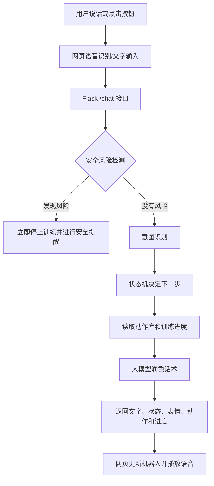

# 对话式康复陪练机器人

> 一个融合规则状态机、生成式 AI、语音交互与动作动画的康复训练陪伴原型。

本项目探索如何在安全、可控的前提下，将大模型应用于康复训练陪伴场景。系统能够引导用户完成简单的手部与上肢训练，并提供动作说明、进度记录、语音反馈、情绪鼓励和风险提醒。

> **核心理念：让规则决定“做什么”，让大模型优化“怎么说”。**

## 内容导航

- [项目背景](#1-项目背景)
- [设计思路](#2-设计思路)
- [系统架构](#3-系统架构)
- [项目结构](#4-项目结构)
- [对话状态机](#5-对话状态机)
- [训练流程](#6-训练流程)
- [安全机制](#7-安全机制)
- [大模型的作用与边界](#8-大模型的作用与边界)
- [项目亮点](#9-项目亮点)
- [当前局限](#10-当前局限)
- [后续方向](#11-后续方向)
- [运行方式](#12-运行方式)
- [总结](#13-总结)

## 1. 项目背景

本项目主要面向老年人、运动功能障碍人群，以及其他有基础康复训练需求的用户，尝试通过语音、表情和动作动画，提供更自然、更易操作的训练陪伴体验。

系统不承担疾病诊断或医疗方案制定工作，也不能替代医生与康复治疗师。它的定位是在专业人员制定的训练方案下，承担数字化“陪练员”的角色：

- 讲解康复动作；
- 记录完成次数；
- 在训练过程中给予鼓励；
- 支持暂停、休息、继续和结束；
- 发现疼痛或不适后立即停止训练；
- 支持简单闲聊，提升陪伴感。

---

## 2. 设计思路

传统康复训练经常面临以下问题：

1. 用户不容易记住动作步骤；
2. 独自训练缺少反馈和鼓励；
3. 老年用户操作复杂软件的门槛较高；
4. 出现疼痛、头晕等情况时，需要及时提醒用户停止；
5. 完全由大模型自由生成训练方案，存在不可控风险。

针对这些问题，本项目没有将训练决策完全交给大模型，而是采用“确定性规则 + 生成式 AI”的混合架构：

| 模块 | 主要职责 |
| --- | --- |
| Python 状态机 | 控制训练流程、次数、休息和结束 |
| 安全规则 | 检测疼痛、头晕、胸闷等风险信号 |
| JSON 动作库 | 保存动作名称、步骤、次数和动画类型 |
| 大模型 | 润色固定话术、处理普通闲聊 |
| Flask | 提供网页入口和对话接口 |
| 网页前端 | 表情、动作动画、语音识别和语音播报 |

这种架构兼顾了以下两点：

- **可控性：** 动作、次数和安全规则由程序明确控制；
- **自然性：** 大模型让机器人的语言更温柔、更有陪伴感。

---

## 3. 系统架构



如果分享平台不支持 Mermaid，可以把架构简单理解为：

```text
用户输入
   ↓
Flask 接口
   ↓
安全检测（最高优先级）
   ↓
意图识别与状态机
   ↓
动作库与训练计数
   ↓
大模型润色语言
   ↓
网页表情、动画和语音输出
```

---

## 4. 项目结构

```text
rehab_chatbot/
├── app.py                 # Flask 启动入口及 HTTP 接口
├── agent.py               # 对话状态机、意图识别和训练逻辑
├── safety.py              # 风险识别与安全停止回复
├── llm.py                 # OpenAI/Claude 调用与本地兜底
├── exercises.json         # 康复训练动作配置
├── requirements.txt       # Python 依赖
└── templates/
    └── index.html         # 机器人界面、动画和语音交互
```

### `app.py`

负责启动 Flask 服务，并提供三个主要入口：

- `/`：打开机器人网页；
- `/start`：初始化机器人并主动问候；
- `/chat`：接收用户每一次文字或语音输入。

### `agent.py`

这是项目的核心文件，主要负责：

- 判断用户意图；
- 管理当前训练状态；
- 选择训练项目；
- 记录完成次数和休息次数；
- 生成鼓励、反馈和训练总结。

### `safety.py`

保存风险关键词和安全停止逻辑。安全检查优先于普通聊天及训练控制。

### `llm.py`

负责调用 OpenAI 或 Claude：

- 优先使用 OpenAI；
- 没有 OpenAI 时可以使用 Claude；
- API 不可用时自动退回本地固定话术。

### `exercises.json`

用配置文件保存训练项目。当前包含：

| 训练项目 | 目标 | 次数 |
| --- | --- | ---: |
| 手指张合训练 | 训练手指主动活动与灵活性 | 10 |
| 手腕屈伸训练 | 训练手腕活动度 | 8 |
| 桌面触点训练 | 训练上肢伸展与协调能力 | 6 |

将动作放在 JSON 中，可以降低后续扩展成本。

### `templates/index.html`

前端不是普通的聊天窗口，而是一个机器人交互界面，主要包括：

- 不同情绪对应的眼睛、嘴巴和符号；
- 手指张合、手腕屈伸和桌面触点动画；
- 浏览器语音识别；
- 中文语音播报；
- 完成按钮和调试输入面板。

---

## 5. 对话状态机

从程序结构上看，这个机器人是一个以自然语言作为交互入口的状态机。

主要状态包括：

| 状态 | 含义 |
| --- | --- |
| `idle` | 待机 |
| `ask_training` | 询问用户是否训练 |
| `pre_check` | 训练前安全确认 |
| `instruction` | 动作说明 |
| `training` | 正在训练和计数 |
| `rest` | 休息 |
| `feedback` | 训练完成后的身体反馈 |
| `safety_stop` | 因疼痛或不适而安全停止 |
| `summary` | 生成训练总结 |

典型训练流程如下：

```text
问候
  ↓
询问是否训练
  ↓
选择并讲解动作
  ↓
开始训练
  ↓
完成一次 → 计数和鼓励
  ↓
达到目标次数
  ↓
询问身体感受
  ↓
生成训练总结
```

训练中还可以进入两个分支：

```text
训练中 → 用户说“休息” → 休息状态 → 用户说“继续” → 恢复训练

训练中 → 用户报告疼痛或不适 → 安全停止 → 禁止继续训练
```

---

## 6. 训练流程

以“手指张合训练”为例：

1. 用户打开网页，机器人主动问候；
2. 用户说“开始”或“我想练手指”；
3. 系统根据关键词选择手指张合训练；
4. 机器人讲解动作，并播放对应手部动画；
5. 用户完成一次后说“完成”；
6. 系统计数，并通过不同表情和话术给予鼓励；
7. 用户可以随时说“休息”“继续”“再说一遍”或“结束”；
8. 达到目标次数后，机器人询问是否疼痛或疲劳；
9. 系统生成包含完成次数、目标次数和休息次数的训练总结。

例如，后端每次都会返回一组结构化数据：

```json
{
  "reply": "很好，已经完成第3次，还剩7次。",
  "state": "training",
  "exercise_name": "手指张合训练",
  "face": "smile",
  "motion": "demo_hand",
  "count": 3,
  "target": 10,
  "show_continue": true
}
```

前端不需要理解康复逻辑，只需要根据这些字段更新界面、动画和语音。

---

## 7. 安全机制

安全检测是整个项目优先级最高的逻辑。

系统会检测以下类型的表达：

- 疼、痛、麻木；
- 头晕、胸闷、心慌；
- 呼吸困难、恶心；
- 摔倒或明显不舒服；
- 手臂、肩膀等部位疼痛。

发现风险后，系统会：

1. 立即切换到 `safety_stop` 状态；
2. 停止当前动作和训练计数；
3. 显示严肃表情和停止动画；
4. 提醒用户坐稳、放松，不要继续动作；
5. 建议不适持续时联系家属或专业康复人员。

安全停止话术不会交给大模型改写，避免重要警告被弱化。

系统也处理了常见的否定表达。例如：

- “我不疼”；
- “没有头晕”；
- “没有不舒服”。

这些表达不会被误判为风险。

---

## 8. 大模型的作用与边界

大模型主要负责两项工作。

### 8.1 润色固定话术

规则系统先决定训练动作、次数和下一状态，大模型只负责把回复改得：

- 更自然；
- 更温柔；
- 更适合老年用户；
- 更适合语音朗读。

### 8.2 支持简单闲聊

用户可以聊心情、生活、睡眠或天气等日常话题。机器人会先回应用户，而不是每一句都强行拉回训练。

提示词对模型进行了明确限制：

- 不改变训练动作名称；
- 不改变训练次数；
- 不新增训练动作；
- 不提供诊断和用药建议；
- 不承诺训练效果；
- 必须保留安全提醒；
- 输出简短中文，适合语音播报。

因此，大模型在这个项目中更像“语言与陪伴层”，而不是“医疗决策层”。

---

## 9. 项目亮点

### 9.1 可控的大模型应用

没有让大模型直接决定医疗训练，而是把大模型限制在语言表达范围内。

### 9.2 安全优先

安全检测先于闲聊、动作选择和训练计数。一旦发现风险，立即中断普通流程。

### 9.3 数据驱动

动作名称、目标、步骤、次数和动画类型均保存在 JSON 中，便于增加新的训练项目。

### 9.4 多模态交互

将文字、语音、表情、动画和训练进度组合在一起，降低用户操作门槛。

### 9.5 降级可用

即使没有大模型 API 或网络连接，状态机、安全逻辑和本地固定话术仍可继续工作。

---

## 10. 当前局限

本项目目前处于功能原型阶段，适合用于技术验证、教学演示和交互设计研究，尚不具备医疗级产品所需的完整验证与合规条件。

主要局限包括：

- 训练完成由用户主动说“完成”，系统不能自动判断动作是否规范；
- 没有摄像头姿态识别、可穿戴设备或运动传感器；
- 当前 Agent 是全局对象，更适合单用户演示；
- 没有账号、数据库和长期训练档案；
- 风险识别主要基于关键词，无法覆盖所有复杂表达；
- 没有根据患者诊断、患侧和活动范围制定个性化方案；
- `pre_check` 和 `instruction` 状态已经预留，但当前主流程基本直接进入训练；
- 前端的空闲计时器目前只展示文字提示，没有真正调用后端的主动提醒分支；
- 仍需要由专业康复人员审核动作内容和安全边界。

---

## 11. 后续方向

这个原型可以沿着以下方向继续完善：

1. **视觉动作识别**：使用摄像头判断动作幅度、速度和规范性；
2. **传感器接入**：通过手环、压力传感器或机械臂采集训练数据；
3. **用户系统**：建立患者账号和长期训练记录；
4. **治疗师后台**：让专业人员配置动作、次数和注意事项；
5. **个性化方案**：根据用户能力动态调整难度；
6. **数据分析**：形成周报、趋势图和训练依从性分析；
7. **更完整的安全机制**：增加风险等级、紧急联系人和人工介入；
8. **多设备部署**：适配平板、手机、桌面机器人及康复机构终端。

---

## 12. 运行方式

### 12.1 安装依赖

建议使用 Python 虚拟环境：

```bash
python -m venv .venv
source .venv/bin/activate
pip install -r requirements.txt
```

### 12.2 配置大模型（可选）

项目支持 OpenAI 和 Claude。先复制仓库中不含真实密钥的配置示例：

```bash
cp .env.example .env
```

然后在本地 `.env` 中配置其中一个 API Key：

```dotenv
OPENAI_API_KEY=your_openai_api_key
# 或
ANTHROPIC_API_KEY=your_anthropic_api_key
```

如果不配置 API Key，系统仍会使用本地兜底话术运行基础训练流程。

`.env` 已被 `.gitignore` 排除，不能提交到 GitHub；可公开提交的是 `.env.example`。如果密钥曾经进入 Git 提交历史或公开页面，请立即撤销旧密钥并生成新密钥。

### 12.3 启动项目

```bash
python app.py
```

服务默认运行在 `5030` 端口。在本机浏览器中打开：

```text
http://127.0.0.1:5030
```

如需在手机上使用语音输入，浏览器通常要求页面运行在安全上下文中。项目支持通过环境变量开启临时 HTTPS：

```bash
APP_HOST=0.0.0.0 HTTPS=1 python app.py
```

然后使用与电脑处于同一局域网的手机访问电脑对应的 HTTPS 地址。首次访问时，需要在浏览器中允许麦克风权限。

### 12.4 生成手机分享链接

macOS 用户可以直接运行项目内的分享脚本：

```bash
./share.command
```

如果使用 VS Code，也可以打开 `share.py`，点击右上角的“运行 Python 文件”按钮。不要运行 `app.py`：它只启动本地开发服务，不负责创建公网链接和二维码。

脚本会自动启动项目，并生成一个带可信 HTTPS 证书的临时地址，例如：

```text
https://example.trycloudflare.com/?access=随机访问令牌
```

将该地址发给手机即可体验，不要求手机和电脑连接同一个 Wi-Fi。分享期间需要保持电脑联网，并且不能关闭脚本所在的终端窗口；按 `Control+C` 可以结束分享。

脚本还会自动生成并打开二维码图片，现场观众可以直接扫码。临时地址和二维码在每次重新运行后可能发生变化。

每次运行脚本都会生成一个新的二维码文件。请以本次启动后新打开的二维码窗口为准；旧二维码在对应的终端关闭后就会失效。

每台手机通过独立会话保存训练状态，可以同时体验，不会共享训练项目、完成次数和休息状态。会话数据只保存在电脑内存中，项目停止后自动清空。

分享模式使用 Waitress 服务并且仅监听本机地址，外部设备只能通过临时 HTTPS Tunnel 访问。二维码包含每次随机生成的访问令牌，没有本次令牌的请求会被拒绝。系统还限制请求大小、输入长度和访问频率，并设置安全 Cookie、内容安全策略、防嵌套、禁缓存等响应头。

该方式不会开放路由器端口，也不会授予访问者查看电脑文件的权限。由于二维码在展示期间仍是有效入口，请只提供给现场体验者，并在展示结束后及时按 `Control+C` 关闭。

---

## 13. 总结

本项目通过规则状态机保证训练流程，通过安全模块约束交互边界，通过大模型提升语言自然度，再由网页端完成语音、表情和动作呈现，形成了一个可控、可扩展的对话式康复陪练机器人原型。

它所展示的不只是一个聊天机器人，更是一种生成式 AI 在高安全要求场景中的落地思路：

> **确定性系统负责可靠决策，生成式模型负责人性化表达。**

---

### 使用声明

本项目仅用于学习、研究与原型展示，不构成医疗诊断、治疗或康复处方。实际训练动作、强度与频率应由具备资质的专业人员根据用户具体情况评估和制定。
